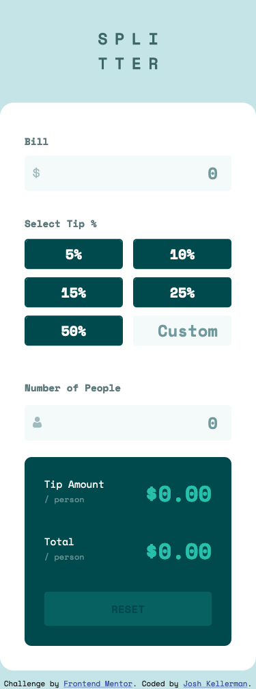

# Frontend Mentor - Tip calculator app solution

This is a solution to the [Tip calculator app challenge on Frontend Mentor](https://www.frontendmentor.io/challenges/tip-calculator-app-ugJNGbJUX). Frontend Mentor challenges help you improve your coding skills by building realistic projects.

## Table of contents

- [Overview](#overview)
  - [The challenge](#the-challenge)
  - [Screenshot](#screenshot)
  - [Links](#links)
- [My process](#my-process)
  - [Built with](#built-with)
  - [What I learned](#what-i-learned)
  - [Continued development](#continued-development)
  - [Useful resources](#useful-resources)
- [Author](#author)

## Overview

### The challenge

Users should be able to:

- View the optimal layout for the app depending on their device's screen size
- See hover states for all interactive elements on the page
- Calculate the correct tip and total cost of the bill per person

### Screenshot




### Links

- Solution URL: [Solution](https://github.com/jkellerman/tip-calculator-app-main)
- Live Site URL: [Live Site](https://jkellerman.github.io/tip-calculator-app-main/)

## My process

### Built with

- Semantic HTML5 markup
- CSS custom properties
- Flexbox
- CSS Grid
- Mobile-first workflow
- ES6 JavaScript

### What I learned

One of the key things I learned from this task was how to get a string from an element and convert it to a float or integer.

I also learned how to set a maximum amount of characters into an input field using JS. See snippet below.

```js
function limit(element) {
  let max_chars = 8;
  if (element.value.length > max_chars) {
    element.value = element.value.substring(0, max_chars);
  }
}
```

### Continued development

Create a normal calculator

### Useful resources

- [Stack Overflow](https://stackoverflow.com/questions/9841363/how-to-restrict-number-of-characters-that-can-be-entered-in-html5-number-input-f) - This helped me use JS to limit the amount of characters that can be entered into an input field.
- [MDN Web Docs](https://developer.mozilla.org/en-US/docs/Web/JavaScript/Reference/Global_Objects/parseFloat) - This helped me understand how to convert a string into a float.

## Author

- Frontend Mentor - [@jkellerman](https://www.frontendmentor.io/profile/jkellerman)
